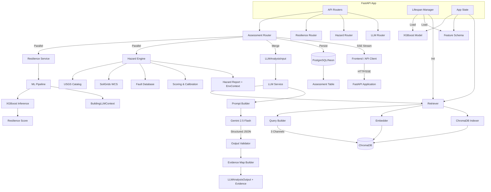
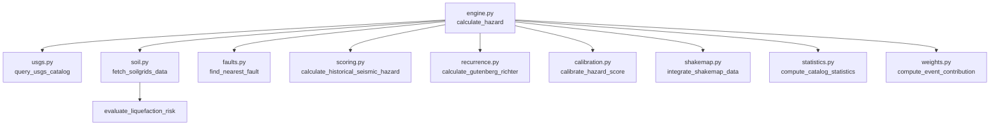
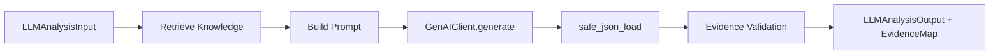
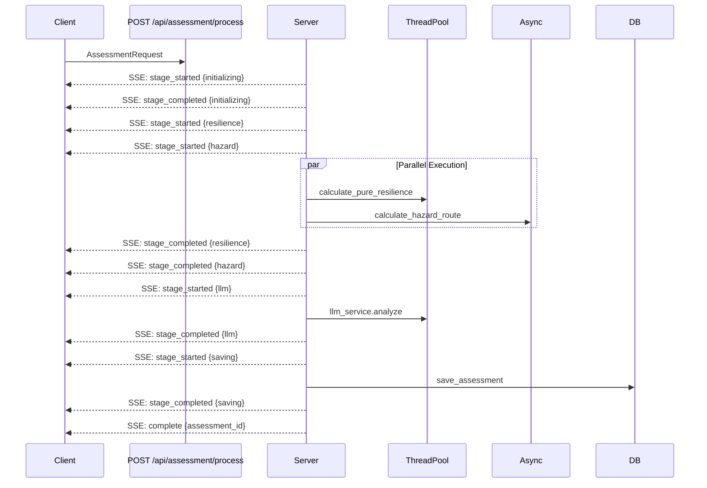

# System Architecture

> **Component relationships, data flow, and architectural patterns of the ResilienceAI backend**

---

## High-Level Architecture



---

## Component Breakdown

### 1. FastAPI Application (`main.py`)

**Responsibilities:**
- Application lifecycle management via `lifespan` context manager
- CORS configuration for frontend origins
- Router registration with tags for OpenAPI grouping
- Application state injection (ML model, feature schema, retriever)

**Lifespan Flow:**
```python
@asynccontextmanager
async def lifespan(app: FastAPI):
    # 1. Validate model files exist
    # 2. Load XGBoost model via joblib
    # 3. Load expected feature list from JSON
    # 4. Initialize retriever (graceful degradation if unavailable)
    # 5. Inject into app.state
    yield
    # Cleanup (none currently)
```

**App State:**
```python
app.state.model              # XGBoost Booster
app.state.expected_features  # List[str] (121 features)
app.state.retriever          # Retriever | None
```

---

### 2. API Routers

| Router | Prefix | Tag | Purpose |
|--------|--------|-----|---------|
| `resilience.py` | `/api/resilience` | Resilience Score engine | Pure ML prediction endpoint |
| `hazard.py` | `/api/hazard` | Hazard Engine | Environmental hazard calculation |
| `llm.py` | `/api/llm` | LLM Service | Standalone LLM analysis |
| `assessment.py` | `/api/assessment` | Orchestration, Database | Full pipeline + SSE + persistence |

**Router Independence:**
- Each router can be called independently for modular use
- `assessment.py` imports functions from other routers/services directly (no internal HTTP calls)
- `llm.py` supports both retriever-enabled and retriever-disabled modes

---

### 3. ML Inference Pipeline

**Files:**
- `services/pipeline.py` — `StructuralFeatureExtractor`, `scale_user_inputs`, `process_and_align_inference_data`
- `services/resilience_engine.py` — `calculate_resilience_score`
- `services/resilience_service.py` — `predict_resilience` (orchestrator)

**Flow:**
```mermaid
flowchart LR
    Input[BuildingInput\nPydantic] --> Dump[model_dump]
    Dump --> DF[DataFrame\n1 row]
    DF --> Scale[scale_user_inputs\narea_sq_ft → area_percentage\nheight_ft → height_percentage]
    Scale --> Transform[StructuralFeatureExtractor\nfit_transform]
    Transform --> OHE[pd.get_dummies\ncategorical encoding]
    OHE --> Align[Reindex to\nexpected_features]
    Align --> Predict[XGBoost predict_proba]
    Predict --> Score[calculate_resilience_score\nP(Low)*100 + P(Med)*45]
    Score --> Output[ResilienceAssessmentResponse]
```

**Feature Engineering Details:**
- **Non-linear scaling**: Physical dimensions mapped to Richter dataset quantile codes via `np.interp`
- **Derived features**: `height_to_floor_ratio`, `area_to_height_ratio`, `structural_age_stress`
- **Material flags**: `is_highly_vulnerable_material`, `is_engineered_material`
- **Categorical encoding**: One-hot for `foundation_type`, `roof_type`, `ground_floor_type`
- **Schema alignment**: Missing columns filled with 0, reordered to match training (121 features)

---

### 4. Hazard Engine (`services/hazard_engine/`)

**Module Dependencies:**


**Scoring Formula:**
```
Event Score  = min(35, 13 * ln(1 + Σ(event_contributions)))
Fault Score  = 26 * exp(-distance_km / 31)
Soil Score   = 14 * min(1, LSI)
Raw Combined = Event + Fault + Soil + 2.5
Final Score  = 100 * (1 - exp(-Raw / 31.8))  // Capped at 100
```

**Hazard Levels:**
| Score Range | Level |
|-------------|-------|
| 0–20 | Very Low |
| 20–40 | Low |
| 40–60 | Moderate |
| 60–80 | High |
| 80–100 | Very High |

**External Dependencies:**
| Service | Protocol | Purpose | Fallback |
|---------|----------|---------|----------|
| USGS FDSNWS | HTTPS/GeoJSON | Earthquake catalog | Empty event list |
| SoilGrids | WCS/GeoTIFF | Soil properties | Regional heuristic |
| USGS ShakeMap | HTTPS/GeoJSON | Ground motion | Estimated from MMI |

---

### 5. RAG Retrieval System (`services/retrieval/`)

**Architecture:**

```mermaid
graph TB
    subgraph "Index Build (scripts/build_kb_index.py)"
        Loader[ChunkLoader] --> Validate[Frontmatter Validation]
        Validate --> Chunk[Semantic Chunking]
        Chunk --> Embed[Embedder\nall-MiniLM-L6-v2]
        Embed --> Index[Indexer\nChromaDB PersistentClient]
        Index --> Collection[(Collection:\nresilienceai_knowledge)]
    end
    
    subgraph "Query Time (Retriever.retrieve)"
        Builder[QueryBuilder] --> Channels[3 Channels]
        Channels --> Vuln[Building Vulnerability]
        Channels --> Env[Environmental]
        Channels --> Local[Local Context]
        
        Vuln --> Search[ChromaDB Query\ncategory_filter + embedding]
        Env --> Search
        Local --> Search
        
        Search --> Boost[Tag Boosting\n+0.05 per matching tag]
        Boost --> Dedupe[Deduplicate by chunk_id]
        Dedupe --> Rank[Sort by boosted score]
        Rank --> TopK[Return top-k per channel]
    end
```


**Knowledge Base Structure:**
```
data/knowledge/
├── building_vulnerability/    # 7 docs
├── earthquake_safety/         # N docs
├── environmental_hazards/     # N docs
├── local_context/             # Myanmar-specific
└── mitigation/                # Retrofit guidance
```

**Document Frontmatter Schema:**
```yaml
id: "unique-doc-id"
category: "building_vulnerability"  # One of 5 valid categories
tags: ["mud_mortar_stone", "retrofit"]  # Material/feature tags
source:
  title: "Document Title"
  organization: "GEM Foundation"
  url: "https://..."
  license: "CC-BY-4.0"
applies_when:  # Optional conditional metadata
  material_codes: ["mud_mortar_stone"]
```

**Chunking Strategy:**
- Documents < 600 chars: Single chunk
- Larger docs: Split at major section headings (`## Source`, `## Retrofit Guidance`, etc.)
- Each chunk gets unique `chunk_id`: `{doc_id}__chunk_{index}`

**Retrieval Channels:**
| Channel | Categories | Tags Filter | K | Purpose |
|---------|------------|-------------|---|---------|
| Building Vulnerability | building_vulnerability, mitigation | Active material tags | 2 | Structural weakness guidance |
| Environmental | environmental_hazards | None | 2 | Hazard-specific knowledge |
| Local Context | local_context | None | 1 | Myanmar-specific guidance |

---

### 6. LLM Integration (`services/llm_services.py`)

**Components:**


**Prompt Structure:**
```
SYSTEM INSTRUCTIONS
-----------------------------
BUILDING CONTEXT (JSON)
-----------------------------
ENVIRONMENTAL CONTEXT (JSON)
-----------------------------
RETRIEVED KNOWLEDGE (optional)
-----------------------------
OUTPUT REQUIREMENTS (JSON schema)
```

**Output Schema (`LLMAnalysisOutput`):**
- `summary`: List of key findings with `evidence_ids`
- `recommendations`: Priority, title, description, `evidence_ids`
- `risk_interpretation`: Structural, environmental, overall reasoning
- `confidence`: 0.0–1.0

**Evidence Validation:**
- LLM cites `chunk_id`s in `evidence_ids` fields
- Service validates cited IDs against actually retrieved chunks
- Invalid/hallucinated IDs filtered out with warning logs
- Validated citations returned as `EvidenceCitation` map

**Failure Handling:**
- Retrieval failure → Empty knowledge, continue without RAG
- LLM JSON parse failure → Regex extraction fallback
- LLM API failure → Retry with exponential backoff (3 attempts)
- All failures logged, assessment continues

---

### 7. Database Layer (`database/`)

**Schema (SQLAlchemy ORM):**
```sql
CREATE TABLE assessments (
    id UUID PRIMARY KEY DEFAULT gen_random_uuid(),
    created_at TIMESTAMPTZ DEFAULT NOW(),
    place_name TEXT,
    latitude DOUBLE PRECISION NOT NULL,
    longitude DOUBLE PRECISION NOT NULL,
    resilience_score DOUBLE PRECISION NOT NULL,
    hazard_score DOUBLE PRECISION NOT NULL,
    hazard_level VARCHAR(20) NOT NULL,
    profile JSONB NOT NULL,      -- BuildingInput
    building JSONB NOT NULL,     -- ResilienceAssessmentResponse
    hazard JSONB NOT NULL,       -- HazardReport
    llm JSONB NOT NULL,          -- LLMAnalysisOutput + evidence
    model_version VARCHAR(50),
    execution_time_seconds DOUBLE PRECISION
);
```

**Indexes:** `created_at`, `resilience_score`, `hazard_score`, `hazard_level`

**Session Management:** `get_db()` FastAPI dependency with `SessionLocal`, auto-commit/rollback

---

### 8. Assessment Orchestration (`routes/assessment.py`)

**SSE Event Stream:**


**Stage Timing (Typical):**
| Stage | Duration | Notes |
|-------|----------|-------|
| Initializing | ~50ms | Payload validation |
| Resilience (ML) | ~200ms | Thread pool, CPU-bound |
| Hazard | ~3–8s | External API calls (USGS, SoilGrids) |
| LLM | ~3–8s | Gemini API, includes retrieval |
| Saving | ~100ms | DB write |
| **Total** | **6–17s** | Dominated by external APIs |

---

## Data Models Summary

| Model | Source | Purpose |
|-------|--------|---------|
| `BuildingInput` | `project_schema.py` | User building parameters (validated) |
| `HazardInput` | `project_schema.py` | Hazard query parameters |
| `ResilienceAssessmentResponse` | `project_schema.py` | ML output + LLM context |
| `HazardReport` | `project_schema.py` | Full hazard engine output |
| `EnvironmentalContext` | `project_schema.py` | LLM-friendly hazard summary |
| `BuildingLLMContext` | `project_schema.py` | LLM-friendly building summary |
| `LLMAnalysisInput` | `project_schema.py` | Combined input for LLM |
| `LLMAnalysisOutput` | `project_schema.py` | Structured LLM response |
| `AssessmentRequest` | `project_schema.py` | Full assessment input |
| `SaveAssessmentRequest` | `project_schema.py` | DB persistence payload |
| `AssessmentIDResponse` | `project_schema.py` | DB record representation |

---

## Configuration & Constants

| File | Key Constants |
|------|---------------|
| `hazard_engine/constants.py` | Decay distances, fault thresholds, magnitude coeff |
| `hazard_engine/weights.py` | Weight computation formulas |
| `retrieval/embedder.py` | Model name (`all-MiniLM-L6-v2`), dimension (384) |
| `retrieval/chunk_loader.py` | Valid categories, chunk separators |
| `richtor_mappings.py` | Feature code → description mappings |
| `project_schema.py` | All Pydantic field constraints |

---

## Deployment Considerations

| Aspect | Current State | Notes |
|--------|---------------|-------|
| **Model Serving** | In-process joblib | Single worker; use multiple workers for production |
| **Vector DB** | ChromaDB persistent local | File-based; not distributed |
| **Database** | Neon PostgreSQL | Serverless, auto-scales |
| **External APIs** | USGS, SoilGrids, Gemini | Rate limits apply; implement caching for production |
| **SSL** | `certifi` for Gemini | Required for HTTPS calls |
| **CORS** | Configured for localhost:3000, 5500 | Update for production domains |

---

## Architectural Concerns

### ✅ Strengths
- **Modular design**: Clear separation of ML, Hazard, RAG, LLM layers
- **Graceful degradation**: Retriever failure doesn't block assessment
- **Streaming UX**: SSE provides real-time progress for long-running pipeline
- **Auditability**: Full JSONB persistence enables replay/debugging
- **Deterministic hazard**: No ML model drift in environmental scoring

### ⚠️ Known Issues
| Issue | Location | Impact |
|-------|----------|--------|
| Single-threaded ML inference | `resilience_engine.py` | Blocks event loop; uses `asyncio.to_thread` |
| No connection pooling for ChromaDB | `indexer.py` | New client per retriever |
| USGS/SoilGrids timeouts | `usgs.py`, `soil.py` | Can add 6s+ latency |
| No request validation middleware | `main.py` | Relies on Pydantic only |
| Sync `geopy` in async route | `assessment.py:30-39` | Blocks event loop during geocoding |

### 🔧 Technical Debt
- Hazard engine uses hardcoded fault list (not dynamic)
- LLM prompt building uses string concatenation (not templated)
- No structured logging correlation IDs across stages
- Test coverage gaps in hazard engine modules
- No OpenTelemetry / distributed tracing

---

## Future Architecture Evolution

See [Future Improvements](future_improvements.md) for detailed roadmap.