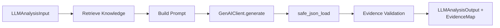

# LLM Integration Documentation

> **Google Gemini integration, prompt engineering, structured output validation, and failure handling**

---

## Overview

The LLM integration uses **Google Gemini 2.5 Flash** via the `google-genai` SDK to generate structured risk interpretations and retrofit recommendations. The system employs **retrieval-augmented generation (RAG)** with evidence citation validation.

---

## Architecture



---

## Components

### 1. GenAIClient (`services/llm_services.py`)

**Wrapper for Gemini API with retry logic and robust extraction.**

```python
class GenAIClient:
    def __init__(self, model: str = "gemini-2.5-flash", api_key: Optional[str] = None):
        self.client = genai.Client(api_key=api_key or os.getenv("GEMINI_API_KEY"))
        self.model = model
    
    def generate(self, prompt: str, schema: Dict[str, Any], max_retries: int = 3) -> Dict[str, Any]:
        # 1. Clean schema (remove additionalProperties)
        schema = clean_schema(schema)
        
        # 2. Retry loop with exponential backoff
        for attempt in range(max_retries):
            try:
                response = self.client.models.generate_content(
                    model=self.model,
                    contents=prompt,
                    config=types.GenerateContentConfig(
                        response_mime_type="application/json",
                        response_schema=schema,
                        temperature=0.1,
                    ),
                )
                
                # 3. Robust text extraction
                raw_text = getattr(response, "text", None)
                if not raw_text:
                    raw_text = extract_from_candidates(response)
                
                if not raw_text:
                    raise ValueError("Empty response from Gemini")
                
                return safe_json_load(raw_text)
                
            except (RuntimeError, TimeoutError) as e:
                # Retry only transient failures
                sleep_time = (2 ** attempt) + random.uniform(0, 0.5)
                time.sleep(sleep_time)
            except Exception as e:
                raise RuntimeError(f"Non-retryable error: {e}") from e
        
        raise RuntimeError(f"Gemini failed after {max_retries} retries")
```

**Key Features:**
- **Structured output**: `response_mime_type="application/json"` + `response_schema`
- **Low temperature**: 0.1 for consistency
- **Retry logic**: Exponential backoff for transient errors (3 attempts)
- **Schema cleaning**: Removes `additionalProperties` (unsupported by Gemini)
- **Robust extraction**: Handles both `response.text` and candidate parts

---

### 2. LLMService (`services/llm_services.py`)

**Main orchestration class for LLM analysis with RAG.**

```python
class LLMService:
    def __init__(self, client: GenAIClient, retriever: Optional[Retriever] = None):
        self.client = client
        self.retriever = retriever  # Optional - graceful degradation
        self._last_retrieval_ms = 0.0
        self._last_retrieval_results = []
    
    def analyze(self, input_data: LLMAnalysisInput) -> Tuple[LLMAnalysisOutput, Dict[str, EvidenceCitation]]:
        # 1. Retrieve knowledge (fail-safe)
        retrieved_knowledge, retrieved_results = self._retrieve_knowledge(
            building=input_data.building_context,
            env=input_data.environmental_context
        )
        
        # 2. Build prompt
        prompt = self._build_prompt(
            building=input_data.building_context,
            env=input_data.environmental_context,
            retrieved_knowledge=retrieved_knowledge
        )
        
        # 3. Generate with schema
        schema = LLMAnalysisOutput.model_json_schema()
        result = self.client.generate(prompt, schema=schema)
        
        # 4. Build evidence map
        evidence_map = self._build_evidence_map(retrieved_results, result)
        
        return LLMAnalysisOutput(**result), evidence_map
```

---

## Prompt Engineering

### Prompt Structure (`_build_prompt`)

```
SYSTEM INSTRUCTIONS
-------------------
You are a seismic risk engineering AI assistant.

Your task is to analyze building structural vulnerability and environmental seismic hazard,
then return a structured JSON response.

You MUST follow the output format exactly and return ONLY valid JSON.
Do not include any explanations outside the JSON.

-----------------------------
BUILDING CONTEXT
-------------------
{building.model_dump()}

-----------------------------
ENVIRONMENTAL CONTEXT
---------------------
{env.model_dump()}

-----------------------------
RETRIEVED KNOWLEDGE (if available)
----------------------------------
Reference 1 [chunk_id: vuln-rc-engineered__chunk_0]
Category: mitigation
Title: RC Engineered Seismic Detailing
Source: FEMA P-750
...chunk text...

-----------------------------
OUTPUT REQUIREMENTS
-------------------
Return ONLY valid JSON matching the schema.
```

### Prompt Sections

| Section | Method | Content |
|---------|--------|---------|
| System | `_system_instructions()` | Role definition, output constraints |
| Building | `_building_section()` | `BuildingLLMContext` as JSON |
| Environmental | `_environmental_section()` | `EnvironmentalContext` as JSON |
| Knowledge | `_knowledge_section()` | Formatted retrieval results |
| Output | `_output_requirements()` | Schema reminder |

### Knowledge Formatting

```python
def _format_retrieved_knowledge(results):
    lines = ["", "Retrieved Knowledge", "",
             "The following information comes from the project's engineering knowledge base "
             "and should be treated as supporting reference material.", ""]
    
    for i, result in enumerate(results, 1):
        lines.append(f"Reference {i} [chunk_id: {result.chunk_id}]")
        lines.append(f"Category: {result.metadata.get('category', 'General')}")
        if result.metadata.get('title'):
            lines.append(f"Title: {result.metadata['title']}")
        if result.metadata.get('source_org'):
            lines.append(f"Source: {result.metadata['source_org']}")
        lines.append("")
        lines.append(result.text.strip())
        lines.append("")
    
    return "\n".join(lines).strip()
```

**Key Design Decisions:**
- Scores **NOT exposed** to LLM (prevents bias)
- Chunk IDs included for citation
- Source metadata for credibility
- Clear separation with delimiters

---

## Output Schema (`LLMAnalysisOutput`)

Defined in `project_schema.py`:

```python
class SummaryItem(BaseModel):
    text: str
    evidence_ids: List[str] = []

class LLMRecommendation(BaseModel):
    priority: str  # "High", "Medium", "Low"
    title: str
    description: str
    evidence_ids: List[str] = []

class RiskInterpretation(BaseModel):
    structural_assessment: str
    environmental_assessment: str
    overall_reasoning: str

class LLMAnalysisOutput(BaseModel):
    summary: List[SummaryItem]
    recommendations: List[LLMRecommendation]
    risk_interpretation: RiskInterpretation
    confidence: float  # 0.0-1.0
```

### Example Output

```json
{
  "summary": [
    {
      "text": "The building uses RC engineered construction which provides good ductility and seismic performance.",
      "evidence_ids": ["vuln-rc-engineered__chunk_0"]
    },
    {
      "text": "Moderate hazard level combined with engineered structure suggests manageable risk with proper maintenance.",
      "evidence_ids": ["env-hazard-moderate__chunk_1"]
    }
  ],
  "recommendations": [
    {
      "priority": "High",
      "title": "Verify Seismic Detailing Compliance",
      "description": "Confirm the RC frame meets MNBC 2016 ductile detailing requirements...",
      "evidence_ids": ["mitigation-rc-detailing__chunk_0"]
    }
  ],
  "risk_interpretation": {
    "structural_assessment": "The building employs RC engineered superstructure...",
    "environmental_assessment": "The site experiences Moderate seismic hazard...",
    "overall_reasoning": "An engineered RC structure in a moderate hazard zone..."
  },
  "confidence": 0.87
}
```

---

## Evidence Citation Validation

### Process (`_build_evidence_map`)

```python
def _build_evidence_map(self, retrieved_results, llm_result):
    # 1. Collect all cited IDs from LLM output
    cited_ids = set()
    for item in llm_result.get("summary", []):
        cited_ids.update(item.get("evidence_ids", []))
    for rec in llm_result.get("recommendations", []):
        cited_ids.update(rec.get("evidence_ids", []))
    
    # 2. Validate against retrieved chunks
    valid_ids = {r.chunk_id for r in retrieved_results}
    validated_ids = [eid for eid in cited_ids if eid in valid_ids]
    
    # 3. Log invalid citations
    for eid in cited_ids:
        if eid not in valid_ids:
            logger.warning("LLM returned invalid evidence_id '%s' not in retrieved set. Ignoring.", eid)
    
    # 4. Build EvidenceCitation objects
    for chunk_id in validated_ids:
        result = result_map[chunk_id]
        evidence_map[chunk_id] = EvidenceCitation(
            chunk_id=chunk_id,
            source_title=result.metadata.get("title", ""),
            source_org=result.metadata.get("source_org", ""),
            source_url=result.metadata.get("source_url", ""),
            category=result.metadata.get("category", ""),
            excerpt=result.text[:300] + ("..." if len(result.text) > 300 else ""),
            relevance_score=result.score
        )
    
    return evidence_map
```

### EvidenceCitation Schema

```python
class EvidenceCitation(BaseModel):
    chunk_id: str
    source_title: str = ""
    source_org: str = ""
    source_url: str = ""
    category: str = ""
    excerpt: str = ""
    relevance_score: float = 0.0  # 0-1
```

**Validation Rules:**
- Only cited chunks that were actually retrieved are included
- Hallucinated chunk IDs are filtered with warning logs
- Excerpt truncated to 300 chars for storage efficiency

---

## Failure Handling

| Failure Point | Handling |
|---------------|----------|
| **Retriever unavailable** | Log info, continue with empty knowledge |
| **Retrieval error** | Log warning, continue with empty knowledge |
| **Gemini API timeout** | Retry 3× with exponential backoff (2s, 4s, 8s + jitter) |
| **Gemini API error** | Non-retryable errors raised immediately |
| **Empty response** | Raise `ValueError`, caught → retry |
| **Invalid JSON** | `safe_json_load` fallback: extract first `{...}` block |
| **Schema validation error** | Pydantic validation on `LLMAnalysisOutput(**result)` |
| **Evidence hallucination** | Filter invalid IDs, log warnings, continue |

### safe_json_load

```python
def safe_json_load(text: str) -> Dict[str, Any]:
    try:
        return json.loads(text)
    except Exception:
        start = text.find("{")
        end = text.rfind("}")
        if start == -1 or end == -1:
            raise ValueError("Model did not return valid JSON")
        return json.loads(text[start:end])
```

---

## LLM Router (`routes/llm.py`)

### Endpoint: `POST /api/llm/analysis`

```python
@router.post("/analysis", response_model=LLMAnalysisOutput)
def analyze(input_data: LLMAnalysisInput, request: Request):
    # Get retriever from app state if available
    retriever = getattr(request.app.state, "retriever", None)
    if retriever is not None:
        service = create_llm_service(retriever=retriever)
    else:
        service = llm_service  # Module-level without retriever
    
    result = service.analyze(input_data)
    return result.model_dump()
```

### Module-Level Service (Backward Compatible)

```python
# Created at import time without retriever
llm_service = create_llm_service()
```

---

## Integration with Assessment Pipeline

In `routes/assessment.py`:

```python
# Capture retriever from app state
retriever = getattr(request.app.state, "retriever", None)
llm_service = create_llm_service(retriever=retriever)

# Build LLM input from resilience + hazard results
llm_input = LLMAnalysisInput(
    building_context=building_json["building_llm_context"],
    environmental_context=hazard_json["environmental_context"]
)

# Run in thread pool (blocking call)
llm_data, evidence_map = await asyncio.to_thread(
    llm_service.analyze,
    llm_input
)
```

**Evidence Persistence:**
```python
# Merge evidence into LLM JSONB for storage
llm["evidence"] = evidence_map
```

---

## Configuration

| Setting | Location | Value |
|---------|----------|-------|
| Model | `GenAIClient` | `gemini-2.5-flash` |
| Temperature | `GenAIClient.generate` | 0.1 |
| Max retries | `GenAIClient.generate` | 3 |
| Backoff base | `GenAIClient.generate` | 2^attempt seconds |
| API key | Env var | `GEMINI_API_KEY` |
| SSL cert | `llm_services.py` | `certifi.where()` |

---

## Environment Setup

```bash
# Required
export GEMINI_API_KEY="your-api-key"

# Auto-configured in llm_services.py
export SSL_CERT_FILE=$(python -c "import certifi; print(certifi.where())")
```

---

## Testing

```bash
# Unit test LLM service
pytest tests/test_llm_service.py -v

# Integration test with retrieval
pytest tests/test_llm_retrieval_integration.py -v

# Full pipeline validation
python scripts/validate_pipeline.py
# Output shows: "LLM Confidence: 0.87", "Recommendations: 2"
```

---

## Limitations

| Limitation | Impact |
|------------|--------|
| Single provider (Gemini) | No fallback LLM |
| No streaming output | Full response waited before returning |
| Fixed temperature (0.1) | Less creative, more deterministic |
| Evidence validation only at chunk level | Can't verify claim accuracy within chunk |
| No citation format enforcement | LLM may cite non-existent IDs (filtered post-hoc) |
| Prompt not templated | String concatenation; harder to maintain |

---

## Future Improvements

- Add fallback LLM provider (Anthropic, OpenAI)
- Implement streaming response for long generations
- Add prompt templating (Jinja2)
- Fine-tune on earthquake engineering QA pairs
- Add claim-level verification (not just chunk-level)
- Implement few-shot examples in prompt
- Add structured logging for prompt/response pairs