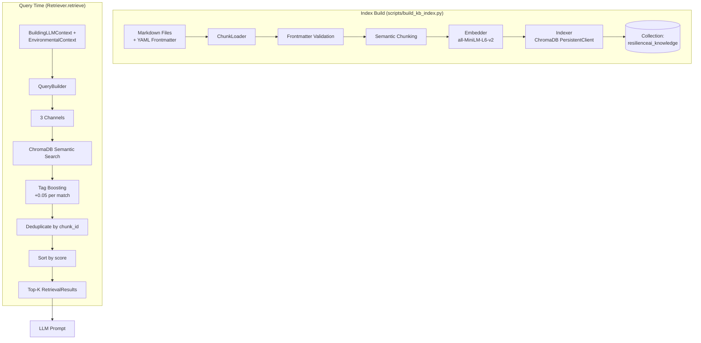

# RAG System Documentation

> **Knowledge base structure, document processing, embeddings, ChromaDB retrieval, and query generation**

---

## Overview

The RAG (Retrieval-Augmented Generation) system provides the LLM with curated earthquake engineering knowledge to ground its recommendations in authoritative sources. It uses **ChromaDB** for vector storage and **Sentence Transformers** for embeddings.

---

## Architecture



---

## Knowledge Base Structure

### Directory Layout
```
backend/data/knowledge/
├── building_vulnerability/    # 7 documents
├── earthquake_safety/         # N documents
├── environmental_hazards/     # N documents
├── local_context/             # Myanmar-specific
└── mitigation/                # Retrofit guidance
```

### Valid Categories (`chunk_loader.py`)
```python
VALID_CATEGORIES = {
    "building_vulnerability",
    "earthquake_safety",
    "environmental_hazards",
    "local_context",
    "mitigation",
}
```

---

## Document Format

Each knowledge document is a **Markdown file with YAML frontmatter**:

```markdown
---
id: "vuln-materials-overview"
category: "building_vulnerability"
tags: ["materials", "superstructure", "overview", "richter_dataset"]
source:
  title: "Global Earthquake Model (GEM) Building Taxonomy v3.0"
  organization: "GEM Foundation"
  url: "https://www.globalquakemodel.org/gem-building-taxonomy"
  license: "CC-BY-4.0"
  retrieved: "2026-07-20"
applies_when:
  material_codes: ["adobe_mud", "mud_mortar_stone", "cement_mortar_brick", "rc_non_engineered", "rc_engineered", "timber"]
---

# Building Superstructure Materials Overview

Content here...

## Retrofit Guidance

More content...

## Myanmar Adaptation

Region-specific content...
```

### Frontmatter Schema

| Field | Type | Required | Description |
|-------|------|----------|-------------|
| `id` | string | Yes | Unique document identifier |
| `category` | string | Yes | One of 5 valid categories |
| `tags` | array[string] | Yes | Material/feature tags for boosting |
| `source.title` | string | Yes | Document title |
| `source.organization` | string | Yes | Publishing organization |
| `source.url` | string | Yes | Source URL |
| `source.license` | string | No | License (e.g., CC-BY-4.0) |
| `applies_when` | object | No | Conditional metadata (e.g., material_codes) |

### Validation (`chunk_loader.py:validate_frontmatter`)

Checks:
- All required fields present
- `category` ∈ `VALID_CATEGORIES`
- `tags` is a list
- `source` has title, organization, url
- `applies_when` is a dict if present
- No duplicate `id` across documents

---

## Chunking Strategy (`chunk_loader.py:chunk_document`)

### Rules
1. **Small documents (< 600 chars)**: Single chunk
2. **Large documents**: Split at major section headings

### Separator Patterns
```python
CHUNK_SEPARATORS = [
    r"^## Source",
    r"^## Retrofit Guidance",
    r"^## Retrofit Strategies?",
    r"^## Critical Improving Factors",
    r"^## Myanmar-Specific",
    r"^## Hazard Engine Integration",
    r"^## Cost-Benefit",
    r"^## Myanmar Adaptation",
    r"^## Building Implications",
]
```

### Chunk ID Format
```
{doc_id}__chunk_{index}
# Example: vuln-materials-overview__chunk_0
```

### Chunk Metadata
Each `KnowledgeChunk` carries:
- `chunk_id`, `doc_id`, `category`, `tags`
- `title` (from first H1), `text` (chunk content)
- `source_title`, `source_org`, `source_url`, `source_license`
- `chunk_index`, `total_chunks`
- `metadata` (extra: `applies_when`, supplementary sources)

---

## Embeddings (`services/retrieval/embedder.py`)

### Model
- **Model**: `all-MiniLM-L6-v2` (Sentence Transformers)
- **Dimension**: 384
- **Device**: Auto-detect (CPU/GPU)
- **Normalization**: L2-normalized (cosine similarity ready)

### Loading
```python
# Lazy-loaded on first use
model = SentenceTransformer(model_name, device=device)
dimension = model.get_embedding_dimension()  # 384
```

### Encoding
```python
embeddings = model.encode(
    texts,
    convert_to_numpy=True,
    normalize_embeddings=True,
    show_progress_bar=False,
    batch_size=32
)
```

---

## ChromaDB Index (`services/retrieval/indexer.py`)

### Configuration
| Setting | Value |
|---------|-------|
| Collection | `resilienceai_knowledge` |
| Distance | Cosine (HNSW) |
| Persistence | Local filesystem (`backend/data/chroma/`) |
| Telemetry | Disabled |

### Index Build Process
```python
def build(self) -> int:
    # 1. Load & validate all documents
    loader = ChunkLoader(knowledge_dir)
    chunks = loader.load_all()
    
    # 2. Generate embeddings
    texts = [c.text for c in chunks]
    embeddings = embedder.embed(texts)
    
    # 3. Prepare metadata
    ids = [c.chunk_id for c in chunks]
    metadatas = [{
        "doc_id": c.doc_id,
        "category": c.category,
        "tags": ",".join(c.tags),  # Stored as comma-separated string
        "title": c.title,
        "chunk_index": c.chunk_index,
        "total_chunks": c.total_chunks,
        "source_title": c.source_title,
        "source_org": c.source_org,
        "source_url": c.source_url,
        "source_license": c.source_license or "",
        **{f"meta_{k}": v for k,v in c.metadata.items()}
    } for c in chunks]
    
    # 4. Replace existing collection data
    collection.delete(collection.get()["ids"])
    collection.add(embeddings=embeddings.tolist(), documents=texts, metadatas=metadatas, ids=ids)
```

### Metadata Fields in ChromaDB
| Field | Type | Purpose |
|-------|------|---------|
| `doc_id` | string | Document identifier |
| `category` | string | For `$in` filtering |
| `tags` | string | Comma-separated, for tag boosting |
| `title` | string | Document title |
| `source_title` | string | Citation |
| `source_org` | string | Citation |
| `source_url` | string | Citation |
| `chunk_index` | int | Position in document |
| `meta_*` | various | Extra frontmatter data |

---

## Query Building (`services/retrieval/query_builder.py`)

### Three Retrieval Channels

| Channel | Categories | Tags Filter | k | Purpose |
|---------|------------|-------------|---|---------|
| `building_vulnerability` | `building_vulnerability`, `mitigation` | Active material tags from building | 2 | Structural weakness guidance |
| `environmental` | `environmental_hazards` | Soil class, hazard level, fault proximity | 2 | Hazard-specific knowledge |
| `local_context` | `local_context` | Hazard level + summary | 1 | Myanmar-specific guidance |

### Channel 1: Building Vulnerability
```python
def _build_vulnerability_channel(self, building):
    parts = []
    
    # Material description
    material_desc = self._material_description(building)  # e.g., "building with rc_engineered superstructure"
    if material_desc: parts.append(material_desc)
    
    # Structural characteristics
    floors = building.structural.get("floors", 0)
    age = building.structural.get("age_years", 0)
    if floors > 3: parts.append(f"multi-story building with {floors} floors")
    if age > 50: parts.append("older building age vulnerability")
    elif age > 30: parts.append("moderate age structural fatigue")
    
    # Foundation/roof
    foundation = building.material.get("foundation_type", "")
    roof = building.material.get("roof_type", "")
    if foundation: parts.append(f"foundation type: {foundation}")
    if roof: parts.append(f"roof type: {roof}")
    
    # Active tags for boosting
    active_tags = self._active_material_tags(building)
    
    return ChannelQuery(
        query="; ".join(parts),
        category_filter=["building_vulnerability", "mitigation"],
        tags_filter=active_tags,
        k=2,
        channel_name="building_vulnerability"
    )
```

### Channel 2: Environmental
```python
def _build_environmental_channel(self, env):
    parts = []
    
    hazard_level = getattr(env, "hazard_level", "")
    if hazard_level: parts.append(f"{hazard_level.lower()} seismic hazard")
    
    soil = getattr(env, "soil", None)
    if soil:
        if soil.classification: parts.append(f"soil class {soil.classification}")
        if soil.dominant_soil: parts.append(f"{soil.dominant_soil} soil conditions")
    
    faults = getattr(env, "faults", None)
    if faults and faults.distance_km < 20:
        parts.append("close to active fault")
    
    return ChannelQuery(
        query="; ".join(parts),
        category_filter=["environmental_hazards"],
        k=2,
        channel_name="environmental"
    )
```

### Channel 3: Local Context
```python
def _build_local_context_channel(self, building, env):
    parts = ["Myanmar earthquake risk"]
    if env.hazard_level: parts.append(env.hazard_level.lower())
    if env.summary: parts.append(env.summary[0][:100])
    
    return ChannelQuery(
        query="; ".join(parts),
        category_filter=["local_context"],
        k=1,
        channel_name="local_context"
    )
```

---

## Retrieval (`services/retrieval/retriever.py`)

### Main Flow
```python
def retrieve(self, building: BuildingLLMContext, env: EnvironmentalContext) -> List[RetrievalResult]:
    # 1. Get ChromaDB collection (lazy load)
    collection = self._get_collection()
    
    # 2. Build channel queries
    channels = self.query_builder.build(building, env)
    
    # 3. Search each channel
    all_results = []
    for channel in channels:
        channel_results = self._search_channel(collection, channel)
        all_results.extend(channel_results)
    
    # 4. Deduplicate by chunk_id (keep highest score)
    seen = set()
    unique = []
    for r in sorted(all_results, key=lambda r: r.score, reverse=True):
        if r.chunk_id not in seen:
            seen.add(r.chunk_id)
            unique.append(r)
    
    return unique
```

### Per-Channel Search
```python
def _search_channel(self, collection, channel):
    # 1. Embed query
    query_vector = self.embedder.embed_single(channel.query)
    
    # 2. ChromaDB query with category filter
    n_results = max(channel.k * 10, 20)  # Over-fetch for re-ranking
    where_filter = {"category": {"$in": channel.category_filter}}
    
    raw = collection.query(
        query_embeddings=[query_vector.tolist()],
        n_results=n_results,
        where=where_filter,
        include=["documents", "metadatas", "distances"]
    )
    
    # 3. Score conversion + tag boosting
    results = []
    for doc, meta, distance in zip(...):
        base_score = 1.0 - float(distance)  # Cosine similarity
        final_score = self._apply_tag_boost(base_score, meta, channel.tags_filter)
        
        results.append(RetrievalResult(
            chunk_id=meta.get("chunk_id"),
            text=doc,
            score=final_score,
            metadata=meta,
            channel=channel.channel_name
        ))
    
    # 4. Sort by boosted score, take top-k
    results.sort(key=lambda r: r.score, reverse=True)
    return results[:channel.k]
```

### Tag Boosting
```python
@staticmethod
def _apply_tag_boost(base_score, metadata, tags_filter):
    if not tags_filter: return base_score
    
    chunk_tags = set(metadata.get("tags", "").split(","))
    matched = sum(1 for tag in tags_filter if tag in chunk_tags)
    
    if matched > 0:
        return min(base_score + 0.05 * matched, 1.0)
    return base_score
```

**Boost**: +0.05 per matching tag, capped at 1.0

---

## RetrievalResult

```python
@dataclass
class RetrievalResult:
    chunk_id: str          # Unique chunk identifier
    text: str              # Chunk text content
    score: float           # Relevance (0-1, cosine similarity + boost)
    metadata: Dict         # Full ChromaDB metadata
    channel: str           # Which channel produced this
```

---

## LLM Integration (`services/llm_services.py`)

### Knowledge Formatting
```python
def _format_retrieved_knowledge(results):
    lines = ["", "Retrieved Knowledge", "", 
             "The following information comes from the project's engineering knowledge base...", ""]
    
    for i, result in enumerate(results, 1):
        lines.append(f"Reference {i} [chunk_id: {result.chunk_id}]")
        lines.append(f"Category: {result.metadata.get('category', 'General')}")
        if result.metadata.get('title'):
            lines.append(f"Title: {result.metadata['title']}")
        if result.metadata.get('source_org'):
            lines.append(f"Source: {result.metadata['source_org']}")
        lines.append("")
        lines.append(result.text.strip())
        lines.append("")
    
    return "\n".join(lines).strip()
```

**Key Design**: Scores are **NOT exposed to LLM** — only source/category metadata. Chunk IDs included for citation.

### Evidence Citation Building
```python
def _build_evidence_map(self, retrieved_results, llm_result):
    # 1. Collect all evidence_ids from LLM output
    cited_ids = set()
    for item in llm_result.get("summary", []):
        cited_ids.update(item.get("evidence_ids", []))
    for rec in llm_result.get("recommendations", []):
        cited_ids.update(rec.get("evidence_ids", []))
    
    # 2. Validate against retrieved chunks
    valid_ids = {r.chunk_id for r in retrieved_results}
    validated = [eid for eid in cited_ids if eid in valid_ids]
    
    # 3. Build EvidenceCitation objects
    for chunk_id in validated:
        result = result_map[chunk_id]
        evidence_map[chunk_id] = EvidenceCitation(
            chunk_id=chunk_id,
            source_title=result.metadata.get("title", ""),
            source_org=result.metadata.get("source_org", ""),
            source_url=result.metadata.get("source_url", ""),
            category=result.metadata.get("category", ""),
            excerpt=result.text[:300] + "...",
            relevance_score=result.score
        )
    
    return evidence_map
```

---

## Building the Index

```bash
# Build from scratch
python scripts/build_kb_index.py --verbose

# Force rebuild
python scripts/build_kb_index.py --force

# Check if index exists
python scripts/build_kb_index.py --check
```

**Output:**
```
2026-07-26 12:00:00 [INFO    ] BUILDING KNOWLEDGE BASE VECTOR INDEX
2026-07-26 12:00:00 [INFO    ] Embedding model: all-MiniLM-L6-v2
2026-07-26 12:00:00 [INFO    ] Knowledge base:  backend/data/knowledge
2026-07-26 12:00:00 [INFO    ] ChromaDB dir:    backend/data/chroma
2026-07-26 12:00:00 [INFO    ] Collection:      resilienceai_knowledge
2026-07-26 12:00:01 [INFO    ] Documents processed: 15
2026-07-26 12:00:01 [INFO    ] Chunks created:     42
2026-07-26 12:00:03 [INFO    ] Embeddings generated: shape=(42, 384), dim=384
2026-07-26 12:00:04 [INFO    ] INDEX BUILD COMPLETE
2026-07-26 12:00:04 [INFO    ]   Total chunks indexed:  42
2026-07-26 12:00:04 [INFO    ]   Processing duration:   3.45 seconds
```

---

## Testing Retrieval

```bash
# Unit tests
pytest tests/test_retrieval.py -v

# Integration test
pytest tests/test_llm_retrieval_integration.py -v

# Manual test via validation script
python scripts/validate_pipeline.py
# Output shows: "Retrieved 5 chunks in 120 ms"
```

---

## Configuration

| Setting | Location | Default |
|---------|----------|---------|
| Embedding model | `embedder.py` | `all-MiniLM-L6-v2` |
| ChromaDB dir | `indexer.py` | `backend/data/chroma/` |
| Knowledge dir | `indexer.py` | `backend/data/knowledge/` |
| Collection name | `indexer.py` | `resilienceai_knowledge` |
| Channel k values | `query_builder.py` | 2, 2, 1 |
| Tag boost | `retriever.py` | +0.05 per tag |
| Over-fetch multiplier | `retriever.py` | 10x |

---

## Limitations

| Limitation | Impact |
|------------|--------|
| Static knowledge base | No live updates; rebuild required for new docs |
| No re-ranking model | Cosine similarity + tag boost only |
| Small index (~42 chunks) | Limited coverage; may miss relevant info |
| Single embedding model | No ensemble or domain-specific fine-tuning |
| Tag boosting heuristic | +0.05 arbitrary; not learned |
| No query expansion | User query used directly |

---

## Future Improvements

- Add cross-encoder re-ranker for better precision
- Implement query expansion (synonyms, related terms)
- Add document recency weighting
- Support incremental index updates
- Evaluate larger embedding models (e.g., `bge-large-en-v1.5`)
- Add retrieval evaluation metrics (recall@k, MRR)